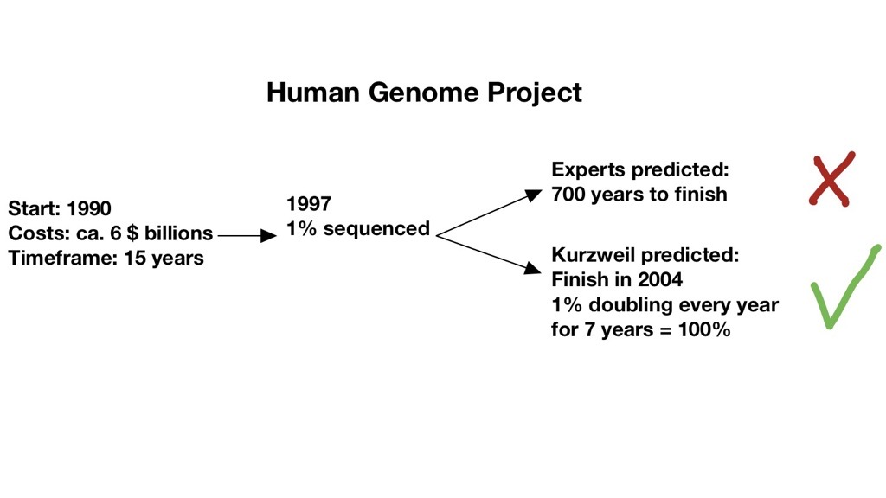

# Exponential Organisation

_By Silvia Martin and Dominique Schmitz_

---

### Law of Accelerating Returns (LOAR) of Kurzweiler:

- Moore's Law -> price/performance of information technology doubles every year or two
- information-enabled and driven domains, disciplines, technologies and industries double their price/performance annually
- Once the doubling pattern starts, it doesn't stop
- modern key technologies are information-enabled and follow the same trajectory

---

> 

---

### Examples of Cost Scale

<u>Industrial Robots</u>

$500.000 in 2008 to $22.000 in 2013: - 23x in 5 years

<u>3D printing</u>

$40.000 in 2007 to $100 in 2014: - 400x in 7 years

<u>Biotech (DNA Sequencing)</u>

$10.000.000 in 2007 to $1.000 in 2014: - 10.000x in 7 years

---

Iridium moment: applying linear tools, processes, or trends of the past to predict an accelerating future. Iridium moment not able to predict exponential acceleration.

---

"Any company designed for success in the 20th century is doomed to failure in the 21st."

David S. Rose

---

### Exponential Organizations (ExO)

Latest embodiment of acceleration

Companies that work in an information-based environment, that delivers fundamentally disruptive opportunities

---

### Definition

- impact/output _at least 10 times larger_ compared to peers because of new organizational techniques that leverage accelerating technologies

- grows faster, bigger and cheaper than competition because it has a _Massive Transformative Purpose (MTP)_ and scales as quickly as tech does

---

### Examples

---

Even traditional industries are more and more information-enabled and with this disruption occurs

Disruptive breakthroughs occur when disparate fields cross

---

### Massive Transformative Purpose (MTP)

capture heart and mind of people inside and outside the organization with a very aspirational position statement
not a mission statement

---

#### Cisco

Mission statement "Shape the future of the Internet by creating unprecedented value and opportunity for our customers, employees, investors and ecosystem partners."

Possible MTP "Connecting everyone, everything, everywhere-all the time"

---

MTP must be unique and is advantageous to first movers

"We're <em>also</em> going to organize the world's information, but better."

---

### MTP has the "power to pull" a community around the ExO

Creation of an ecosystem

---

### Why is an MTP important?

- Enables coherent exponential growth
- Binds collective aspiration
- Attracts top talent across the ecosystem
- Supports a cooperative/non-political culture
- Enables agility and learning

---

## 

---

### The external attributes: SCALE

---

### Staff on demand

###### Rent, don't own

---

- Necessary characteristic for speed, functionality and flexibility in a fast-changing world.
- Most employees are risking to becoming obsolete and uncompetitive.
- Half-life of a learned skill was 30 years. Today it is about 5 years.

* Full-time workforce have the risk to fail to keep their skills up to date
* In any information-enabled business a large internal staff is increasingly unnecessary, counterproductive and expensive

---

Freelancers and contractors are increasingly needed

- Internet reduced the costs of finding and tracking staff
- The rise of number of internet users, rose the volume and quality of freelancers

---

Example of Gigwalk

Platform to find easily and fast large numbers of "employees" for small tasks

---

Example of Kaggle

Platform that hosts private and public algorithm contests
More than 185'000 data scientists worldwide vie for prizes and recognition

---

---

### Community and Crowd

---

"If you build communities and you do things in public, you don't have to find the right people, they find you"

Chris Anderson

---

Trait-based communities: use the internet to share intent, belief, resources, preferences, needs, risks and other characteristics, none of which depend on physical proximity.

---

For an organization or enterprise

Community = core team members + alumni + partners + vendors + customers + users + fans

---

How to build a community?

1. Use the MTP to attract and engage early members
2. Nurture the community
3. Create a platform to automate peer-to-peer engagement

To start fo companies it's easier to join an existing community that shares the same MTP

---

Crowd = concentric rings of people outside the core community. crowd is harder to reach but the numbers are greater

---

Staff on Demand = managed

Crowd = pull-based

---

How to leverage the crowd?

1. Creativity innovation - generate, develop and communicate new ideas by using tools and platforms
2. Validation - obtain measurable evidence about products' and services' success
3. Crowdfunding - help funding ideas using the internet to assemble many small investors (democratization of access to working capital)

---

###### Results of <em>Staff on Demand</em> and <em>Community & Crowd</em>

Core FTEs become smaller
Flexible workforce larger

Increased agility and better in learning and unlearning thanks to diversity and volume of flexible workforce

---

### Algorithms

---

Today the world is run by algorithms:

- Automotive anti-lock braking
- Recommendation engine of Amazon
- Dynamic pricing of airlines
- Success predictions of upcoming blockbusters
- Writing new posts
- Air traffic control
- Credit card fraud detection
- ...

---

Algorithmia
Marketplace for algorithms
Companies are matched with algorithms that can potentially make sense of their data.

---

Two types of algorithms:

- <em>Machine learning</em> Ability to accurately perform new, unseen tasks, built on known properties learned from training or historic data, and based on prediction. Eg. Hadoop and Cloudera, Netflix's movie recommendation
- <em>Deep learning</em> New and exciting subset of Machine learning based on neural net technology. It allows a machine to discover new patterns without being exposed to any historical or training data. Eg. Google X built a neural network, that started to recognize cats after browsing randomly selected YouTube Videos. Describe episodes in videos, play videogames by figuring out the rules of the game and the optimizing performance

---

Technology will make most products and services more effective, personalized and efficient impacting and disrupting many white-collar jobs.

---

AI and algorithms compensate many heuristics in human cognition:

- Anchoring bias
- Availability bias
- Confirmation bias
- Framing bias
- Optimism bias
- Planning fallacy bias
  Sunk-cost or loss-aversion bias

---

How can ExOs implement algorithms?

1. <strong>Gather</strong> data via sensors, humans or import them from public databases
2. <strong>Organize</strong> the data --> ETL (Extract, Transform and Load)
3. <strong>Apply</strong> machine learning tools (eg. Hadoop and Pivotal) or deep learning algorithms (eg. DeepMind, Vicarious and SkyMind)
4. <strong>Expose</strong> the data and APIs to the ExO community to develop new services, functionalities and innovation on top of the existing platform

---

### Leveraged Assets

---

Leasing everything has been used to shift assets from balance sheet

|          Past           |          Today          |
| :---------------------: | :---------------------: |
| Buildings and machinery | Mission-critical assets |

---

Example of TechShop

Collects expensive manufacturing machinery and offers subscribers a small monthly fee ($125 to $175, depending on the location) for unlimited access to its assets

Like gyms for expensive exercise equipment

---

ExOs are flexible a.o. because they don't own assets, even in strategic areas. This allows them to scale quickly as it obviates the need for staff to manage those assets.

---

Non-ownership is the key to owning the future, except, when it comes to scarce resources and assets.

Tesla owns its factories

Amazon owns its warehouses

---

When assets are information-based or commoditized at all, accessing is better than possessing.

---

### Engagement

---

| Sweepstakes, quizzes, coupons, airline miles and loyalty cards |

---

### The internal attributes: IDEAS

---

### Interfaces

- Process that closes gap between SCALE externalities to internal IDEAS control frameworks
- Interfaces are customised filtering and matching processes to process output of external attributes into internal organisation, using algorithms and workflow software

---

### Google's AdWords

 --> muss kleiner

---

### Dashboards

- Track and monitor performance using real-time metrics & performance tracking techniques

---

### Experimentation

---

### Autonomy

---

### Social Technologies

---

### Summary of Characteristics

| _Linear Organisation_ | _ExO_  |
| ------------------------------------------------------- | ---------------------------------------- |
| Top-down & hierarchical organization         | Autonomy, social technologies |
| Driven by financial outcomes                 | MTP, dashboard                |
| Linear, sequential thinking                  | Experimentation, autonomy     |
| Innovation primarily from within             | Innovation at the edges       |
| ...                                                     | ...                                      |

---

| _Linear Organisation_ | _ExO_                   |
| ------------------------------------------------------- | --------------------------------------------------------- |
| Strategic planning = extrapolation from past | MTP, experimentation                           |
| Risk intolerance                             | Experimentation                                |
| Process inflexibility                        | Autonomy, experimentation                      |
| Large number of FTEs                         | Algorithms, community & crowd, staff on demand |
| Controls/owns its own assets                 | Leveraged assets                               |
| Strongly invested in status quo              | MTP, Dashboards, Experimentation               |
| ...                                                     | ...                                                       |

---

# Questions?

---

### Thank you for your Attention

---

### Main Source

Ismail, Salim; Malone, Michael S.; van Geest, Yuri. Exponential Organizations: Why new organizations are ten times better, faster, and cheaper than yours (and what to do about it)

---

---
