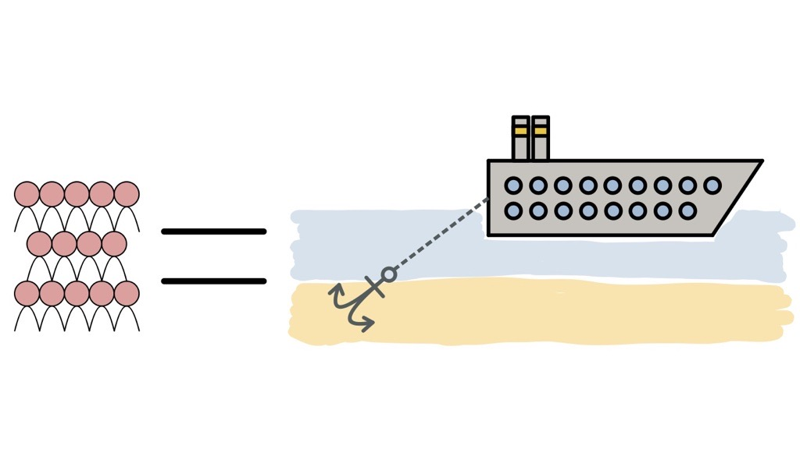

# Exponential Organisation

_By Silvia Martin and Dominique Schmitz_

---

"Any company designed for success in the 20th century is doomed to failure in the 21st."

David S. Rose

---

### Ray Kurzweil's findings of Kurzweil:

- Law of Accelerating Returns (LOAR) based on Moore's Law
- Once the doubling pattern starts, it doesn't stop
- Information-enabled and driven objects double their price/performance annually
- Modern key technologies are information-enabled and follow the same trajectory

---

### Exponential vs. linear development

> 

---

### Examples of Cost Scale

---

### Problem of the <em>Iridium moment</em>

Applying linear tools, processes, or trends of the past to predict an accelerating future. Iridium moment is not able to predict exponential acceleration.

---

### Who was right?

 
Kurzweil: 1% doubling every year = 100% in 7 years

#  👍

---

### Exponential Organizations (ExO)

Latest embodiment of acceleration

Companies that work in an information-based environment, that delivers fundamentally disruptive opportunities

---

### Characteristics

- impact/output _at least 10 times larger_ compared to peers because of new organizational techniques that leverage accelerating technologies

- grows faster, bigger and cheaper than competition because it has a _Massive Transformative Purpose (MTP)_ and scales as quickly as tech does

---

### Examples

---

Even traditional industries are more and more information-enabled

Disruptive breakthroughs occur when disparate fields cross

---

### Massive Transformative Purpose (MTP)

capture ❤️ and 👨 of people inside and outside the organization with a very aspirational position statement

---

Mission statement  
"Shape the future of the Internet by creating unprecedented value and opportunity for our customers, employees, investors and ecosystem partners."

 
Possible MTP 
"Connecting everyone, everything, everywhere-all the time"

---

MTP must be unique and is advantageous to first movers

"We're <em>also</em> going to organize the world's information, but better."

---

### MTP has the "power to pull" a community around the ExO

Creation of an ecosystem

---

### Why is an MTP important?

- Enables coherent exponential growth
- Binds collective aspiration
- Attracts top talent across the ecosystem
- Supports a cooperative/non-political culture
- Enables agility and learning

---

## 

---

### The external attributes: SCALE

---

### Staff on demand

###### Rent, don't own

---

|                Internal staff                 |   Freellancers and contractors    |
| :-------------------------------------------: | :-------------------------------: |
|                Flexibility ⬇️                 | Allows speed and fast change 🏃💨 |
|         Skills quickly outdated 📚🎓          |     Easy to find and track 🔎     |
| Expensive 💸 |       Quality of skills ⬆️        |

---

Platform to find easily and fast large numbers of "employees" for small tasks

---

Platform that hosts private and public algorithm contests
More than 185'000 data scientists worldwide vie for prizes and recognition

---

---

### Community and Crowd

---

"If you build communities and you do things in public, you don't have to find the right people, they find you"

Chris Anderson

---

Trait-based communities: use the internet to share intent, belief, resources, preferences, needs, risks and other characteristics, none of which depend on physical proximity.

---

For an organization or enterprise

Community = core team members + alumni + partners + vendors + customers + users + fans

---

How to build a community?

1. Use the MTP to attract and engage early members
2. Nurture the community
3. Create a platform to automate peer-to-peer engagement

To start fo companies it's easier to join an existing community that shares the same MTP

---

Crowd = concentric rings of people outside the core community. crowd is harder to reach but the numbers are greater

---

Staff on Demand = managed

Crowd = pull-based

---

How to leverage the crowd?

1. Creativity innovation - generate, develop and communicate new ideas by using tools and platforms
2. Validation - obtain measurable evidence about products' and services' success
3. Crowdfunding - help funding ideas using the internet to assemble many small investors (democratization of access to working capital)

---

###### Results of <em>Staff on Demand</em> and <em>Community & Crowd</em>

Core FTEs become smaller
Flexible workforce larger

Increased agility and better in learning and unlearning thanks to diversity and volume of flexible workforce

---

### Algorithms

---

Today the world is run by algorithms:

- Automotive anti-lock braking
- Recommendation engine of Amazon
- Dynamic pricing of airlines
- Success predictions of upcoming blockbusters
- Writing new posts
- Air traffic control
- Credit card fraud detection
- ...

---

Algorithmia
Marketplace for algorithms
Companies are matched with algorithms that can potentially make sense of their data.

---

Two types of algorithms:

- <em>Machine learning</em> Ability to accurately perform new, unseen tasks, built on known properties learned from training or historic data, and based on prediction. Eg. Hadoop and Cloudera, Netflix's movie recommendation
- <em>Deep learning</em> New and exciting subset of Machine learning based on neural net technology. It allows a machine to discover new patterns without being exposed to any historical or training data. Eg. Google X built a neural network, that started to recognize cats after browsing randomly selected YouTube Videos. Describe episodes in videos, play videogames by figuring out the rules of the game and the optimizing performance

---

Technology will make most products and services more effective, personalized and efficient impacting and disrupting many white-collar jobs.

---

AI and algorithms compensate many heuristics in human cognition:

- Anchoring bias
- Availability bias
- Confirmation bias
- Framing bias
- Optimism bias
- Planning fallacy bias
  Sunk-cost or loss-aversion bias

---

How can ExOs implement algorithms?

1. <strong>Gather</strong> data via sensors, humans or import them from public databases
2. <strong>Organize</strong> the data --> ETL (Extract, Transform and Load)
3. <strong>Apply</strong> machine learning tools (eg. Hadoop and Pivotal) or deep learning algorithms (eg. DeepMind, Vicarious and SkyMind)
4. <strong>Expose</strong> the data and APIs to the ExO community to develop new services, functionalities and innovation on top of the existing platform

---

### Leveraged Assets

---

Leasing everything has been used to shift assets from balance sheet

|          Past           |          Today          |
| :---------------------: | :---------------------: |
| Buildings and machinery | Mission-critical assets |

---

Example of TechShop

Collects expensive manufacturing machinery and offers subscribers a small monthly fee ($125 to $175, depending on the location) for unlimited access to its assets

Like gyms for expensive exercise equipment

---

ExOs are flexible a.o. because they don't own assets, even in strategic areas. This allows them to scale quickly as it obviates the need for staff to manage those assets.

---

Non-ownership is the key to owning the future, except, when it comes to scarce resources and assets.

Tesla owns its factories

Amazon owns its warehouses

---

When assets are information-based or commoditized at all, accessing is better than possessing.

---

### Engagement

---

<<<<<<< HEAD

### The internal attributes: IDEAS

=======
<<<<<<< HEAD
1927 Charle's Lindberg's solo nonstop flight Across the Atlantic Ocean

"Employee of the Month" programmes

---

Such as sweepstakes, quizzes, coupons, airline miles and loyalty card

New: techniques have been fully information-enabled, elaborated and socialized, in form of digital reputation systems, games and incentive prizes

---

Gives the opportunity to for virtuous, positive feedback loops assuring a faster growth due to more innovative ideas and customer and community loyalty.
Engagement creates network effects with extraordinary reach impacting customers and the entire external ecosystem and can be used to boost collaboration, innoovation and loyalty of employees.

Examples: Google, Airbnb, Uber, eBay, Yelp, GitHub and Twitter

---

What makes engagement so advantageous?

- Ranking transparency
- Self-efficacy
- Peer pressure
- Eliciting positive rather than negative emotions to drive long-term behavioral change
- Instant feedback
- Clear, authentic rules, goals and rewards
- Virtual currencies or points

---

For Millennials, gaming is a way of life

"Gamification should empower people, not exploit them. It should feel good at the end of the day because you made progress towards something that mattered to you."
Jane McGonigal

---

AI researchers are using gaming to help mapping the human brain. An AI-assisted researcher needs 50 hours to reconstruct one neuron in 3D. The brain has 85 billion neurons.

How long do they need to map all neurons?

---

EyeWire created a game in which players color 2D pieces to form 3d pieces.

In only 2 years more than 100 neurons could be mapped played by 130'000 people

Other Examples: MalariaSpot, GalaxyZoo and Foldit

---

Game techniques:

- <em>Dynamics</em> motivate behavior
- <em>Mechanics</em> help achieve goals
- <em>Components</em> track progress

---

Gamification can be used as a hiring tool

Example: Google and Domino's Pizza

---

Gamification can improve company's internal culture

Example: Pep Boys

Many safety-related incidents and injuries occurred linked to human error. Thefts were increasing
Axonify was introduced, a quiz to educate employees. Correct answers = prizes, incorrect answers = additional testing
Voluntary participation rate: 95%
-45% safety incidents
-55% thefts

---

Incentive competition got famous because of the X Prize Foundation

Used to build the prototype of SpaceShipOne adopted by VirginGalantic

Recently HeroX has been launched, allowing companies to create their own challenges to solve local and global issues.

---

An incentive prize is a clear, measurable and objective goal and is a remuneration for the team that first reaches the objective.

Competitions deliver huge leverage and efficiency and have the ability to transform industries.

Creation of peripheral innovation, leading numerous competitors to race towards a common goal.

---

Example: Vodafone Netherlands

Launch of Vodafone Mobile Clicks (world's largest mobile internet startup contest) in the Netherlands. It expanded to 7 EU countries and engaged more than 900 mobile internet startups.

At the beginning: external competition providing Vodafone opportunities to fund and acquire ideas, identify and acquire talented candidates.
Became a form of corporate venture capital: creation of the Startupbootcamp (SBC), Vodafone's incubator/accelerator program across Europe

---

Positive side effect of engagement is TRAINING

Complexity of some games provide education in leadership and teamwork skills.

Becoming a WOW guild master = total-immersion course in leadership

---

Engagement is a key element for scaling the organization in crowd and community and creating external network effects.

# ExO needs to optimize the engagement of crowd and community, otherwise it will wither and fade.

<<<<<<< HEAD

| Sweepstakes, quizzes, coupons, airline miles and loyalty cards |

---

### The internal attributes: IDEAS

---

### Interfaces

- Customised filtering and matching processes to process output of external attributes into internal organisation, using algorithms and workflow software

- Especially critical for scalling globally

---

### Examples

| _UBER_                                           | _TED_                                                     |
| ---------------------------------------------------------------------------------- | ------------------------------------------------------------------------------------------- |
| Interface: Driver selection                                             |  Interface: Video translation subtitles                                          |
| Description: System to allow users to find and choose drivers           |  Description: Manage translations created by volunteers (via the vendor dotsub)  |
| Internal Usage: Algorithm matches best/closest driver to user location​ | Internal Usage: Integrate TED Talks translations seamlessly                      |
| SCALE Attribute: Algorithm​                                             | SCALE Attribute: Community & Crowd                                               |

---

### Google's AdWords

-> muss kleiner

<u>Interface:</u> AdWords

<u>Description:</u> User picks keywords to advertise against ​

<u>Internal Usage:</u> Google places ads against search results ​

<u>SCALE Attribute:</u> Algorithms

---

GitHub Interface: Version control system ​

Description: Multiple coders updating software sequentially and in parallel ​

Internal Usage: Platform keeps all contributions in sync ​

SCALE Attribute: Community & Crowd

---

| _Why Imoportant?_                                  | _Dependencies or Prerequisites_ |
| ------------------------------------------------------------------------------------ | ----------------------------------------------------------------- |
| • Filter external abundance into internal value                           |  • Standardized processes to enable automation               |
| • Bridge between external growth drivers and internal stabilizing factors |  • Scalable externalities                                    |
| • Automation allows scalability                                           |  • Algorithms (in most cases)                          |

---

### Dashboards

Track and monitor performance using real-time metrics & performance tracking techniques (i.e. OKR)

---

### OKRs

---

| _Why Imoportant?_                        | _Dependencies or Prerequisites_ |
| -------------------------------------------------------------------------- | ----------------------------------------------------------------- |
| • Track critical growth drivers in real time                    |  • Real time metrics tracked, gathered and analysed          |
| •OKRs create control framework to manage fast growth            |  • OKRs implemented                                          |
| • Minimise exposure from errors because of short feedback loops |  • Cultural acceptance in most cases                   |

---

### Experimentation

NOCH EIN BILD??

- Testing assumptions and constantly experimenting with controlled risks
- Processes are constantly being tweaked with fast feedback loops

---

### Lean Startup movement

BILD einfügen

     “Fail fast and fail often, while eliminating waste.”​

---

| _Why Imoportant?_                     | _Dependencies or Prerequisites_ |
| ----------------------------------------------------------------------- | ----------------------------------------------------------------- |
| • Keep processes aligned with rapidly changing externalities |  • Measurement and tracking of experiements                  |
| • Maximise value captire                                     |  • Cultural acceptance (Failure = experience)                |
| • Risk taking provides an edge and faster learning           |                                                        |

---

### Autonomy

Self-organizing and multi-disciplinary teams operating with decentralized authority

---

### Holocracy Model

- Encourages members to take initiative and gives them a process by which their concerns or ideas can be addressed
- System of distributed authority reduces burden on leaders to make every decision alone

---

---

### Valve Corp - Game Developer

- no managers, but 400 employees
- freedom to create without having to worry about the consequences of failure
- Over 75 million active users on the social entertainment platform
- $2.5 billion equity in 2012​

---

| _Why Imoportant?_          | _Dependencies or Prerequisites_ |
| ------------------------------------------------------------ | ----------------------------------------------------------------- |
| • Increased agility                               |  • MTP                                                       |
|  • More accountability at customer face           |  • Self-starting-employees                                   |
| • Faster reaction/learning time and better morale |  • Dashboards                                          |

---

### Social Technologies

Collaborative tools, such as file sharing, activity streams, wikis, telepresence, virtual reality and emotional sensing to manage real time, zero latency conversations

---

### 7 Key elements

GIF einfügen

---

| _Why Imoportant?_ | _Dependencies or Prerequisites_ |
| --------------------------------------------------- | ----------------------------------------------------------------- |
| • Faster conversations/learning          |  • MTP                                                       |
|  • Faster decision cycles                |  • Cloud social tools                                        |
| • Stabilises team during rapid growth    |  • Cooperative culture                                 |

---

KEY TAKEAWAYS einfügen?

---

### Summary of Characteristics

| _Linear Organisation_ | _ExO_  |
| ------------------------------------------------------- | ---------------------------------------- |
| Top-down & hierarchical organization         | Autonomy, social technologies |
| Driven by financial outcomes                 | MTP, dashboard                |
| Linear, sequential thinking                  | Experimentation, autonomy     |
| Innovation primarily from within             | Innovation at the edges       |

---

| _Linear Organisation_ | _ExO_                   |
| ------------------------------------------------------- | --------------------------------------------------------- |
| Strategic planning = past extrapolation      | MTP, experimentation                           |
| Risk intolerance                             | Experimentation                                |
| Process inflexibility                        | Autonomy, experimentation                      |
| Large number of FTEs                         | Algorithms, community & crowd, staff on demand |
| Controls/owns its own assets                 | Leveraged assets                               |
| Strongly invested in status quo              | MTP, Dashboards, Experimentation               |

---

---

### Thank you for your Attention

gif??

---

### Main Source

Ismail, Salim; Malone, Michael S.; van Geest, Yuri. Exponential Organizations: Why new organizations are ten times better, faster, and cheaper than yours (and what to do about it)

---
