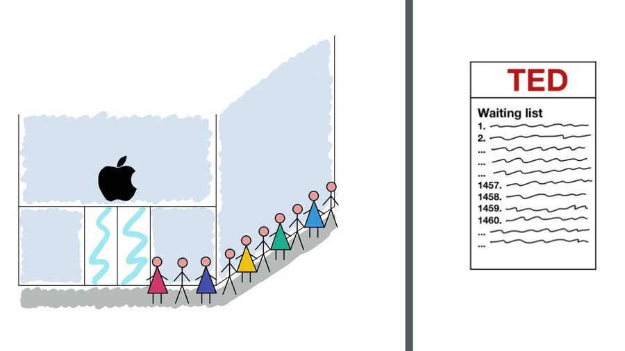

# Exponential Organisation

_By Silvia Martin and Dominique Schmitz_

---

### Definition

- impact/output _at least 10 times larger_ compared to peers because of new organizational techniques that leverage accelerating technologies

- grows faster, bigger and cheaper than competition because it has a _Massive Transformative Purpose (MTP)_ and scales as quickly as tech does

---

Law of Accelerating Returns (LOAR) of Kurzweiler:

- Moore's Law -> price/performance of information technology doubles every 18 months
- information-enabled and driven domains, disciplines, technologies and industries double their price/performance annually

---

> 

---

### Examples

---

### Massive Transformative Purpose (MTP)

---

### Massive Transformative Purpose (MTP)

capture heart and mind of people inside and outside the organization with a very aspirational position statement
not a mission statement

---

### MTP has the "power to pull" a community around the ExO

Creation of an ecosystem

---

## 

---

### The external attributes: SCALE

---

### Examples of Cost Scale

<u>Industrial Robots</u>

$500.000 in 2008 to $22.000 in 2013: - 23x in 5 years

<u>3D printing</u>

$40.000 in 2007 to $100 in 2014: - 400x in 7 years

<u>Biotech (DNA Sequencing)</u>

$10.000.000 in 2007 to $1.000 in 2014: - 10.000x in 7 years

---

### Staff on demand

---

### Community and Crowd

---

### Algorithms

---

### Leveraged Assets

---

### Engagement

---

### The internal attributes: IDEAS

---

### Interfaces

---

### Dashboards

---

### Experimentation

---

### Autonomy

---

### Social Technologies

---

### Summary of Characteristics

| _Linear Organisation_ | _ExO_                                                    |
| ------------------------------------------------------- | ------------------------------------------------------------------------------------------ |
| Top-down & hierarchical in its orga                     | Autonomy, social technologies                                                              |
| Driven by financial outcomes                            | MTP, dashboard                                                                             |
| Linear, sequential thinking                             | Experimentation, autonomy                                                                  |
| Innovation primarily from within                        | Community & crowd, staff on demand, leveraged assets, interfaces (innovation at the edges) |
| ..                                                      | ..                                                                                         |

---

| _Linear Organisation_   | _ExO_        |
| --------------------------------------------------------- | ---------------------------------------------- |
| strategic planning largely an extrapolation from the past | MTP, experimentation                           |
| Risk intolerance                                          | Experimentation                                |
| Process inflexibility                                     | Autonomy, experimentation                      |
| Large number of FTEs                                      | Algorithms, community & crowd, staff om demand |
| Controls/owns its own assets                              | Leveraged assets                               |
| Strongly invested in status quo                           | MTP, Dashboards, Experimentation               |
| ..                                                        | ..                                             |

---

# Questions?

---

### Thank you for your Attention

---
